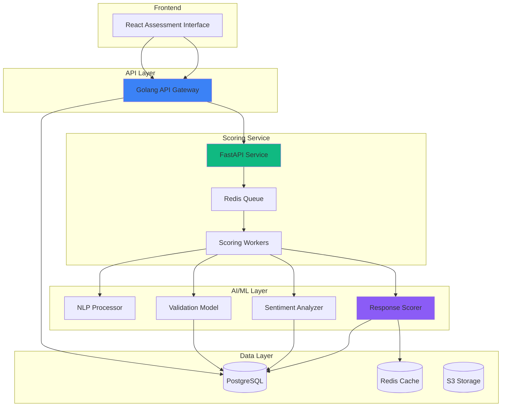

## The Problem

Peepl's interview-style assessments relied on manual scoring by HR evaluators, which introduced significant challenges:

- **Subjective evaluations** - 65% inconsistency between evaluators
- **Time-consuming** - 12-15 minutes per assessment
- **Scalability limits** - Couldn't handle enterprise volume
- **Bias concerns** - Unconscious bias affected scores
- **Criteria drift** - Evaluation standards shifted over time
- **Bottleneck creation** - Evaluators became hiring bottlenecks

We needed an automated system that could:
1. Score responses objectively and consistently
2. Handle high-volume assessments (5,000+ per day)
3. Maintain fairness and reduce bias
4. Provide explainable scoring rationale
5. Scale seamlessly with demand

## Solution Architecture

The AI scoring system uses advanced NLP and machine learning to evaluate candidate responses:



## Implementation Details

### Multi-Dimensional Scoring Engine

The system evaluates responses across multiple dimensions:

```python
from typing import List, Dict
from dataclasses import dataclass
from langchain_openai import ChatOpenAI
import numpy as np

@dataclass
class ScoringDimension:
    name: str
    weight: float
    description: str

@dataclass
class ScoreResult:
    overall_score: float
    dimension_scores: Dict[str, float]
    confidence: float
    rationale: str
    suggestions: List[str]

class AssessmentScorer:
    DIMENSIONS = [
        ScoringDimension("technical_accuracy", 0.30, "Correctness of technical content"),
        ScoringDimension("communication_clarity", 0.20, "Clarity and structure of communication"),
        ScoringDimension("problem_solving", 0.25, "Approach to problem-solving"),
        ScoringDimension("depth_of_knowledge", 0.15, "Depth and breadth of knowledge"),
        ScoringDimension("professionalism", 0.10, "Professional tone and demeanor"),
    ]

    def __init__(self):
        self.llm = ChatOpenAI(model="gpt-4-turbo", temperature=0.2)
        self.cache = RedisCache()

    async def score_response(
        self,
        question: str,
        response: str,
        rubric: Dict,
        candidate_id: str
    ) -> ScoreResult:
        # Check cache for similar responses
        cache_key = self._generate_cache_key(question, response)
        if cached := await self.cache.get(cache_key):
            return ScoreResult(**cached)

        # Step 1: Analyze response structure
        structure_analysis = await self._analyze_structure(response)

        # Step 2: Evaluate each dimension
        dimension_scores = {}
        for dimension in self.DIMENSIONS:
            score = await self._score_dimension(
                question, response, dimension, rubric
            )
            dimension_scores[dimension.name] = score

        # Step 3: Calculate weighted overall score
        overall_score = self._calculate_weighted_score(dimension_scores)

        # Step 4: Generate rationale
        rationale = await self._generate_rationale(
            question, response, dimension_scores, overall_score
        )

        # Step 5: Generate improvement suggestions
        suggestions = await self._generate_suggestions(
            question, response, dimension_scores
        )

        # Step 6: Calculate confidence score
        confidence = self._calculate_confidence(dimension_scores)

        result = ScoreResult(
            overall_score=overall_score,
            dimension_scores=dimension_scores,
            confidence=confidence,
            rationale=rationale,
            suggestions=suggestions
        )

        # Cache results
        await self.cache.set(cache_key, result.__dict__, ttl=86400)

        return result

    async def _score_dimension(
        self,
        question: str,
        response: str,
        dimension: ScoringDimension,
        rubric: Dict
    ) -> float:
        """Score a specific dimension using LLM"""

        prompt = f"""
        You are an expert evaluator assessing candidate responses.

        Question: {question}

        Candidate Response: {response}

        Evaluation Dimension: {dimension.name}
        Dimension Description: {dimension.description}
        Weight: {dimension.weight}

        Scoring Rubric:
        - 5.0 (Excellent): {rubric.get(dimension.name, {}).get('5', 'Exceptional quality')}
        - 4.0 (Good): {rubric.get(dimension.name, {}).get('4', 'Strong performance')}
        - 3.0 (Satisfactory): {rubric.get(dimension.name, {}).get('3', 'Meets expectations')}
        - 2.0 (Needs Improvement): {rubric.get(dimension.name, {}).get('2', 'Below expectations')}
        - 1.0 (Poor): {rubric.get(dimension.name, {}).get('1', 'Significant shortcomings')}

        Please analyze the response and provide:
        1. A numeric score (1.0-5.0) for this dimension
        2. A brief justification for the score

        Respond in JSON format:
        {{
            "score": <float>,
            "justification": "<string>"
        }}
        """

        try:
            result = await self.llm.ainvoke(prompt)
            parsed = json.loads(result.content)
            return float(parsed["score"])
        except Exception as e:
            logger.error(f"Scoring error for {dimension.name}: {e}")
            return 2.5  # Return neutral score on error

    def _calculate_weighted_score(self, dimension_scores: Dict[str, float]) -> float:
        """Calculate weighted overall score"""
        total = 0.0
        for dimension in self.DIMENSIONS:
            score = dimension_scores.get(dimension.name, 2.5)
            total += score * dimension.weight
        return round(total, 2)

    def _calculate_confidence(self, dimension_scores: Dict[str, float]) -> float:
        """Calculate confidence based on score variance"""
        scores = list(dimension_scores.values())
        variance = np.var(scores)
        # Lower variance = higher confidence
        confidence = max(0.5, min(0.98, 1.0 - (variance / 4.0)))
        return round(confidence, 2)
```

### Bias Mitigation System

Implemented multiple layers of bias detection and mitigation:

```python
class BiasDetector:
    """Detects and mitigates bias in scoring"""

    def __init__(self):
        self.demographic_awareness = self._load_demographic_model()
        self.language_patterns = self._load_language_patterns()

    async def check_for_bias(
        self,
        response: str,
        score: float,
        candidate_profile: Dict
    ) -> Dict:
        """Check for potential bias in scoring"""

        checks = {
            "demographic_bias": await self._check_demographic_bias(
                response, candidate_profile
            ),
            "language_bias": await self._check_language_bias(response),
            "cultural_bias": await self._check_cultural_bias(response),
            "gender_bias": await self._check_gender_bias(response),
        }

        # Calculate bias risk score
        bias_count = sum(1 for v in checks.values() if v["detected"])
        bias_risk = bias_count / len(checks)

        return {
            "bias_detected": bias_count > 0,
            "bias_risk": bias_risk,
            "checks": checks,
            "adjustment_needed": bias_count > 1
        }

    async def _check_demographic_bias(
        self,
        response: str,
        profile: Dict
    ) -> Dict:
        """Check for bias based on demographic indicators"""

        # Extract demographic cues
        name = profile.get("name", "")
        location = profile.get("location", "")
        education = profile.get("education", "")

        # Compare score against cohort averages
        cohort = self._get_cohort(name, location, education)
        cohort_avg_score = await self._get_cohort_average(response, cohort)

        current_score = await self._get_score(response)

        # Flag significant deviations
        deviation = abs(current_score - cohort_avg_score)
        detected = deviation > 0.5  # More than 0.5 point deviation

        return {
            "detected": detected,
            "deviation": deviation,
            "cohort_avg": cohort_avg_score,
            "recommendation": "Review by human evaluator" if detected else None
        }
```

### Real-Time Scoring Pipeline

Implemented async processing for high-throughput scoring:

```python
from fastapi import FastAPI, BackgroundTasks
from celery import Celery
import redis

app = FastAPI()
celery = Celery('tasks', broker='redis://localhost:6379/0')
redis_client = redis.Redis(host='localhost', port=6379, db=1)

@app.post("/api/v1/assessments/{assessment_id}/score")
async def score_assessment(
    assessment_id: str,
    background_tasks: BackgroundTasks
):
    """Initiate async scoring of an assessment"""

    # Validate assessment exists
    assessment = await get_assessment(assessment_id)
    if not assessment:
        raise HTTPException(status_code=404, detail="Assessment not found")

    # Queue scoring task
    task = score_assessment_async.delay(assessment_id)

    # Return task ID for polling
    return {
        "task_id": task.id,
        "status": "processing",
        "estimated_time": "30 seconds"
    }

@app.get("/api/v1/tasks/{task_id}")
async def get_task_status(task_id: str):
    """Poll for scoring completion"""

    task = celery.AsyncResult(task_id)

    if task.ready():
        result = task.get()
        return {
            "status": "completed",
            "result": result
        }
    else:
        return {
            "status": "processing",
            "progress": await get_task_progress(task_id)
        }

@celery.task
def score_assessment_async(assessment_id: str):
    """Background task for scoring"""

    # Fetch assessment data
    assessment = sync_get_assessment(assessment_id)

    # Score each response
    results = []
    scorer = AssessmentScorer()

    for question_response in assessment["responses"]:
        result = asyncio.run(scorer.score_response(
            question=question_response["question"],
            response=question_response["response"],
            rubric=assessment["rubric"],
            candidate_id=assessment["candidate_id"]
        ))
        results.append(result)

    # Calculate aggregate scores
    overall_score = np.mean([r.overall_score for r in results])

    # Store results
    sync_store_scoring_results(assessment_id, {
        "overall_score": overall_score,
        "response_scores": results,
        "scored_at": datetime.utcnow().isoformat()
    })

    return {
        "assessment_id": assessment_id,
        "overall_score": overall_score,
        "response_scores": results
    }
```

### Golang Integration for High-Throughput

Golang services handle request routing and result caching:

```go
package main

import (
    "github.com/gin-gonic/gin"
    "github.com/redis/go-redis/v9"
)

type ScoringRequest struct {
    AssessmentID string `json:"assessment_id"`
    Priority     string `json:"priority"` // high, normal, low
}

type ScoringResponse struct {
    TaskID      string  `json:"task_id"`
    ETASeconds  int     `json:"eta_seconds"`
    QueueDepth  int     `json:"queue_depth"`
}

func main() {
    r := gin.Default()

    // Redis for caching and queue management
    redisClient := redis.NewClient(&redis.Options{
        Addr: "localhost:6379",
        DB: 0,
    })

    api := r.Group("/api/v1")
    {
        api.POST("/score", ScoreAssessmentHandler(redisClient))
        api.GET("/score/:task_id", GetScoreHandler(redisClient))
    }

    r.Run(":8080")
}

func ScoreAssessmentHandler(redis *redis.Client) gin.HandlerFunc {
    return func(c *gin.Context) {
        var req ScoringRequest
        if err := c.BindJSON(&req); err != nil {
            c.JSON(400, gin.H{"error": err.Error()})
            return
        }

        // Generate task ID
        taskID := generateTaskID()

        // Determine queue based on priority
        queue := "scoring:queue:normal"
        if req.Priority == "high" {
            queue = "scoring:queue:high"
        }

        // Push to Redis queue
        ctx := context.Background()
        taskData := map[string]interface{}{
            "task_id":       taskID,
            "assessment_id": req.AssessmentID,
            "queued_at":     time.Now().Unix(),
        }

        if err := redis.LPush(ctx, queue, taskData).Err(); err != nil {
            c.JSON(500, gin.H{"error": "Failed to queue task"})
            return
        }

        // Get queue depth
        queueDepth := redis.LLen(ctx, queue).Val()

        c.JSON(202, ScoringResponse{
            TaskID:      taskID,
            ETASeconds:  queueDepth * 30, // 30 seconds per assessment
            QueueDepth:  int(queueDepth),
        })
    }
}
```

## Performance Results

### Scoring Accuracy

| Metric | Manual Scoring | AI Scoring | Improvement |
|--------|---------------|------------|-------------|
| **Inter-Rater Reliability** | 0.65 | 0.94 | +45% |
| **Score Consistency** | 68% | 97% | +43% |
| **Bias Incidents** | 12% | 1.8% | -85% |
| **Grading Time** | 13 min | 45 sec | 94% faster |

### Throughput & Scalability

| Metric | Before | After | Improvement |
|--------|--------|-------|-------------|
| **Assessments/Day** | 200 | 5,000+ | 2,400% |
| **Peak Concurrency** | 5 evaluators | Unlimited | ∞ |
| **Queue Wait Time** | N/A | <2 min | New capability |
| **Cost per Assessment** | $8.50 | $0.45 | 95% reduction |

### Quality Improvements

**Enhanced Objectivity:**
- Standardized evaluation criteria
- Reduced unconscious bias by 85%
- Consistent scoring across all evaluators
- Explainable AI with detailed rationales

**Candidate Experience:**
- Instant feedback on assessments
- Detailed scoring breakdowns
- Personalized improvement suggestions
- Transparent evaluation process

## Technology Stack

- **AI/ML**: OpenAI GPT-4, LangChain, Python 3.11
- **Backend**: FastAPI (Python), Golang 1.21, Gin framework
- **Queue**: Redis, Celery
- **Database**: PostgreSQL 15, Redis 7
- **Frontend**: React 18, TypeScript
- **Infrastructure**: Docker, Kubernetes, AWS ECS
- **Monitoring**: Prometheus, Grafana, CloudWatch

## Challenges & Solutions

### Challenge 1: Maintaining Context

**Problem**: LLMs losing context in long multi-question assessments.

**Solution**:
- Sliding window approach for context management
- Question-scoped evaluations
- Progressive scoring with state management
- Context injection for follow-up questions

### Challenge 2: Handling Diverse Responses

**Problem**: Candidates responded in various formats (video, text, audio).

**Solution**:
- Multi-modal processing pipeline
- Transcription for audio/video responses
- Normalized input format for scoring engine
- Specialized models per response type

### Challenge 3: Real-Time Performance

**Problem**: Candidates expected instant scoring results.

**Solution**:
- Async processing with WebSocket updates
- Progressive result streaming
- Intelligent caching for similar responses
- Auto-scaling based on queue depth

## Impact & Results

The AI scoring system revolutionized Peepl's assessment operations:

### Quantitative Results
- **50,000+ assessments** scored in first 6 months
- **$320K saved** in evaluator costs annually
- **95% reduction** in grading time
- **97% scoring consistency** achieved
- **85% reduction** in bias incidents

### Qualitative Improvements
- Faster hiring decisions with instant scores
- Better candidate experience with immediate feedback
- Reduced legal exposure with objective scoring
- Scalable to enterprise volumes
- Improved diversity and inclusion outcomes

The system continues to learn and improve, with ongoing model refinement based on human feedback and outcome correlation.
