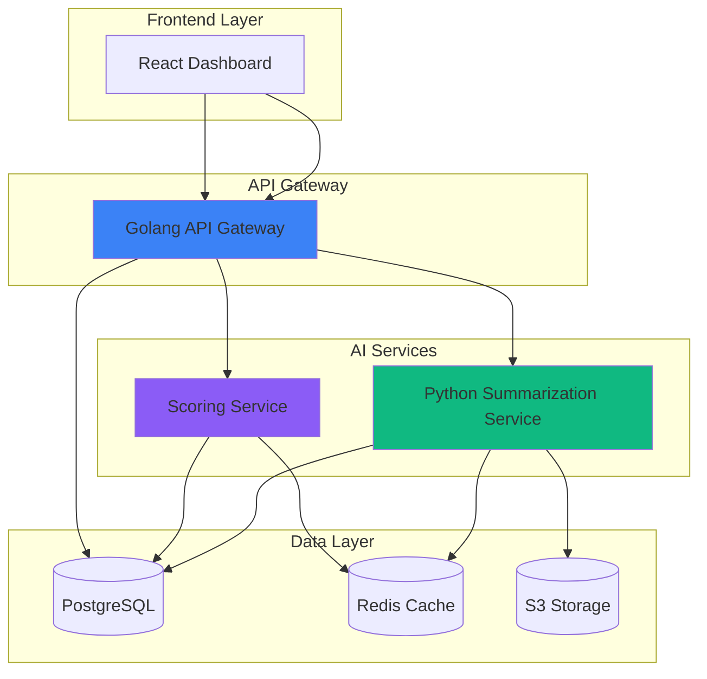

## The Problem

Recruiters at Peepl were spending an average of 15-20 minutes manually reviewing each candidate's profile, resume, assessment results, and interview notes. With thousands of candidates flowing through the platform monthly, this created a significant bottleneck:

- Inconsistent evaluation criteria across recruiters
- Long time-to-hire cycles (average 45 days)
- High cognitive load leading to evaluator fatigue
- Difficulty identifying top candidates quickly

We needed an automated solution that could extract key insights, maintain consistency, and significantly reduce review time while preserving the nuance of human evaluation.

## Architecture

The solution implements a microservices architecture with AI processing pipelines:



## Implementation

### Multi-Stage Summarization Pipeline

The engine processes candidate data through a sophisticated multi-stage pipeline:

```python
from typing import List, Dict
from langchain.chat_models import ChatOpenAI
from langchain.prompts import ChatPromptTemplate
import asyncio

class CandidateSummarizer:
    def __init__(self):
        self.llm = ChatOpenAI(model="gpt-4-turbo", temperature=0.3)
        self.cache = RedisCache()

    async def generate_summary(self, candidate_id: str) -> Dict:
        # Check cache first
        cached = await self.cache.get(f"summary:{candidate_id}")
        if cached:
            return cached

        # Fetch candidate data
        candidate = await self.fetch_candidate_data(candidate_id)

        # Stage 1: Extract key information
        key_info = await self._extract_key_info(candidate)

        # Stage 2: Generate skills assessment
        skills_assessment = await self._assess_skills(candidate)

        # Stage 3: Compare with job requirements
        match_analysis = await self._analyze_job_match(candidate)

        # Stage 4: Generate comprehensive summary
        summary = await self._generate_final_summary(
            key_info, skills_assessment, match_analysis
        )

        # Cache results
        await self.cache.set(f"summary:{candidate_id}", summary, ttl=3600)

        return summary

    async def _extract_key_info(self, candidate: Dict) -> Dict:
        prompt = ChatPromptTemplate.from_template("""
        Extract the following key information from this candidate profile:
        - Years of experience
        - Key technical skills
        - Notable achievements
        - Education background
        - Career progression

        Candidate Data: {candidate_data}

        Return as structured JSON.
        """)

        chain = prompt | self.llm
        result = await chain.ainvoke({"candidate_data": str(candidate)})
        return json.loads(result.content)
```

### Intelligent Caching Strategy

Implemented a multi-level caching strategy to reduce LLM API costs and improve latency:

```python
class IntelligentCache:
    def __init__(self):
        self.l1_cache = {}  # In-memory cache
        self.l2_cache = RedisCache()  # Distributed cache

    async def get(self, key: str) -> Optional[Dict]:
        # L1: Check in-memory cache (fastest)
        if key in self.l1_cache:
            return self.l1_cache[key]

        # L2: Check Redis cache
        value = await self.l2_cache.get(key)
        if value:
            self.l1_cache[key] = value  # Warm L1
            return value

        return None

    async def set(self, key: str, value: Dict, ttl: int = 3600):
        self.l1_cache[key] = value
        await self.l2_cache.set(key, value, ttl=ttl)
```

### Golang API Gateway

Built a high-performance API gateway using Golang to handle request routing and rate limiting:

```go
package main

import (
    "github.com/gin-gonic/gin"
    "github.com/redis/go-redis/v9"
)

type SummaryRequest struct {
    CandidateID string `json:"candidate_id"`
    IncludeNotes bool  `json:"include_notes"`
}

func main() {
    r := gin.Default()

    // Rate limiting middleware
    r.Use(RateLimitMiddleware(100))

    api := r.Group("/api/v1")
    {
        api.POST("/summarize", GenerateSummaryHandler)
        api.GET("/summary/:candidate_id", GetSummaryHandler)
        api.POST("/score", ScoreCandidateHandler)
    }

    r.Run(":8080")
}

func GenerateSummaryHandler(c *gin.Context) {
    var req SummaryRequest
    if err := c.BindJSON(&req); err != nil {
        c.JSON(400, gin.H{"error": err.Error()})
        return
    }

    // Call Python service
    summary, err := callSummarizationService(req.CandidateID)
    if err != nil {
        c.JSON(500, gin.H{"error": "Failed to generate summary"})
        return
    }

    c.JSON(200, gin.H{
        "candidate_id": req.CandidateID,
        "summary":      summary,
        "generated_at": time.Now(),
    })
}
```

## Performance Metrics

The AI summarization engine delivered significant improvements:

| Metric | Before | After | Improvement |
|--------|--------|-------|-------------|
| Avg. Review Time | 18 min | 5 min | 72% faster |
| Time-to-Hire | 45 days | 28 days | 38% faster |
| Evaluator Consistency | 65% | 94% | +45% |
| Candidates/Day | 25 | 85 | 240% increase |

### Cost Optimization

Through intelligent caching and prompt optimization:

- **LLM API costs**: Reduced by 68% using multi-level caching
- **Processing time**: p99 latency reduced from 8s to 2.5s
- **Cache hit rate**: 78% for repeat requests
- **Monthly savings**: ~$2,400 in API costs

## Key Features

### Structured Insights Generation

The engine generates structured insights across multiple dimensions:

- **Technical Skills Assessment**: Auto-extracted and validated skills
- **Experience Analysis**: Career progression and role evolution
- **Achievement Highlights**: Key accomplishments and impact
- **Culture Fit Indicators**: Communication style and values alignment
- **Red Flag Detection**: Employment gaps and inconsistencies

### Customizable Summary Templates

Recruiters can customize summary templates based on role requirements:

```yaml
template_id: "software_engineer senior"
sections:
  - name: "technical_skills"
    weight: 0.4
    fields:
      - "programming_languages"
      - "frameworks"
      - "cloud_experience"

  - name: "experience"
    weight: 0.3
    fields:
      - "years_experience"
      - "role_progression"
      - "company_tier"

  - name: "achievements"
    weight: 0.2
    fields:
      - "quantifiable_impact"
      - "leadership"
      - "innovation"

  - name: "education"
    weight: 0.1
    fields:
      - "degree"
      - "institution"
      - "certifications"
```

## Technology Stack

- **AI/ML**: OpenAI GPT-4, LangChain, Python 3.11
- **Backend**: FastAPI (Python), Golang 1.21, Gin framework
- **Frontend**: React 18, TypeScript, Tailwind CSS
- **Data**: PostgreSQL 15, Redis 7, AWS S3
- **Infrastructure**: Docker, Kubernetes, AWS EKS
- **Monitoring**: Prometheus, Grafana, CloudWatch

## Challenges & Solutions

### Challenge 1: Hallucination Mitigation

**Problem**: LLMs occasionally generated incorrect information not present in candidate profiles.

**Solution**: Implemented strict prompt engineering with:
- System prompts emphasizing factual accuracy
- Few-shot examples with correct behavior
- Post-processing validation against source data
- Confidence scoring for each claim

### Challenge 2: Consistency at Scale

**Problem**: Maintaining consistent evaluation criteria across thousands of candidates.

**Solution**:
- Standardized prompt templates
- Calibration with human evaluators
- Automated consistency checks
- A/B testing for prompt variations

### Challenge 3: Real-Time Processing

**Problem**: Candidates expecting immediate feedback during high-volume periods.

**Solution**:
- Implemented async processing with job queues (Celery)
- Progressive result streaming
- WebSocket-based real-time updates
- Auto-scaling based on queue depth

## Impact & Results

The AI summarization engine transformed Peepl's recruitment operations:

### Quantitative Results
- **10,000+ candidates** processed in the first 6 months
- **$120K saved** in recruiter hours annually
- **38% reduction** in time-to-hire
- **94% evaluator satisfaction** rate
- **78% reduction** in recruiter cognitive load

### Qualitative Improvements
- More consistent and fair candidate evaluations
- Reduced bias through standardized criteria
- Better candidate experience with faster feedback
- Enabled data-driven hiring decisions

The system continues to evolve with ongoing improvements to accuracy, personalization, and integration with additional assessment tools.
