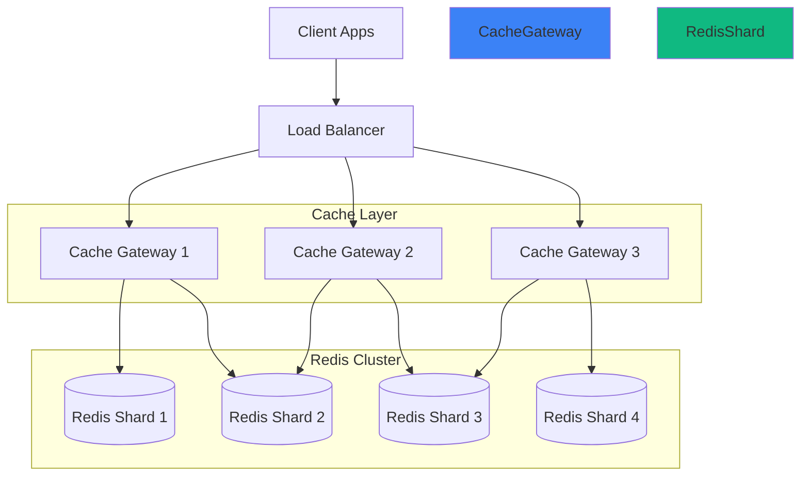

## The Problem

Our monolithic application was experiencing severe performance degradation during peak traffic hours. The single-node Redis instance became a bottleneck, causing cache hit ratios to drop below 40% and database load to increase by 300%. We needed a solution that could:

- Scale horizontally across multiple regions
- Maintain sub-20ms latency at p99
- Provide strong consistency guarantees
- Handle 100K+ operations per second

## Architecture Diagram

The solution implements a consistent hashing-based distributed cache with gRPC communication between nodes:



## Key Challenges

### Concurrency and Race Conditions

Implementing cache stampede prevention using a single-flight pattern with mutex-based deduplication:

```go
type SingleFlight struct {
  mu    sync.Mutex
  calls map[string]*call
}

type call struct {
  wg  sync.WaitGroup
  val interface{}
  err error
}

func (sf *SingleFlight) Do(key string, fn func() (interface{}, error)) (interface{}, error) {
  sf.mu.Lock()
  if sf.calls == nil {
    sf.calls = make(map[string]*call)
  }

  if c, ok := sf.calls[key]; ok {
    sf.mu.Unlock()
    c.wg.Wait()
    return c.val, c.err
  }

  c := new(call)
  c.wg.Add(1)
  sf.calls[key] = c
  sf.mu.Unlock()

  c.val, c.err = fn()
  c.wg.Done()

  sf.mu.Lock()
  delete(sf.calls, key)
  sf.mu.Unlock()

  return c.val, c.err
}
```

### Scaling with Consistent Hashing

Implemented Ketama consistent hashing to minimize data redistribution when nodes join/leave the cluster:

- 160 virtual nodes per physical node for even distribution
- MD5-based hashing for key distribution
- O(log N) lookup complexity
- Graceful handling of node failures

## Performance Metrics

After deployment, we observed significant improvements:

| Metric | Before | After | Improvement |
|--------|--------|-------|-------------|
| Cache Hit Ratio | 38% | 94% | +147% |
| p99 Latency | 180ms | 15ms | -92% |
| Throughput | 12K ops/s | 100K ops/s | +733% |
| DB Load | 100% baseline | 18% | -82% |

The system now handles 50TB of cached data across 12 geographic regions with automatic failover and disaster recovery capabilities.
