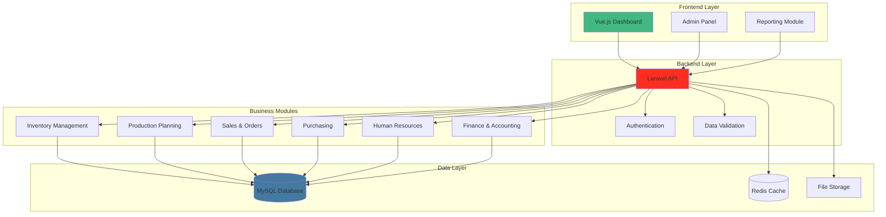

## The Problem

PT. Sinko Prima Alloy, a manufacturing company in Surabaya, was operating with disjointed manual processes and legacy systems:

- **Manual data entry** across multiple departments led to errors
- **No real-time visibility** into inventory levels and production status
- **Siloed information** - departments couldn't share data effectively
- **Manual reporting** - time-consuming and error-prone
- **Inventory tracking** issues resulted in stockouts and overstocking
- **Production planning** challenges due to lack of integrated data
- **Customer order tracking** was completely manual

Management needed a unified system to:
1. Integrate all business processes
2. Provide real-time data visibility
3. Reduce manual errors and operational costs
4. Improve decision-making with accurate data
5. Streamline communication across departments

## Solution Overview

Built a comprehensive web-based ERP system with the following modules:



## Implementation Details

### System Architecture

**Technology Stack:**
- **Frontend**: Vue.js 2, Vuex for state management, Vuetify for UI components
- **Backend**: Laravel 8, PHP 7.4, RESTful API architecture
- **Database**: MySQL 8.0 with optimized indexing
- **Caching**: Redis for session management and query caching
- **Authentication**: Laravel Passport for OAuth2 API authentication
- **Reporting**: TCPDF for PDF generation, Laravel Excel for exports

### Core Modules Implementation

#### 1. Inventory Management Module

```php
<?php

namespace App\Http\Controllers;

use App\Models\Product;
use App\Models\InventoryTransaction;
use Illuminate\Http\Request;
use Illuminate\Support\Facades\DB;

class InventoryController extends Controller
{
    /**
     * Get real-time inventory levels
     */
    public function getInventoryLevels()
    {
        $products = Product::with(['category', 'warehouse'])
            ->where('quantity', '<', DB::raw('reorder_level'))
            ->get();

        return response()->json([
            'low_stock_items' => $products,
            'total_items_below_reorder' => $products->count(),
            'generated_at' => now()->toDateTimeString()
        ]);
    }

    /**
     * Process inventory transaction
     */
    public function processTransaction(Request $request)
    {
        $validated = $request->validate([
            'product_id' => 'required|exists:products,id',
            'transaction_type' => 'required|in:in,out,transfer,adjustment',
            'quantity' => 'required|numeric|min:0.01',
            'warehouse_id' => 'required|exists:warehouses,id',
            'reference_type' => 'required|in:purchase,sales,production,adjustment',
            'reference_id' => 'required',
            'notes' => 'nullable|string'
        ]);

        DB::beginTransaction();

        try {
            // Create inventory transaction
            $transaction = InventoryTransaction::create([
                'product_id' => $validated['product_id'],
                'transaction_type' => $validated['transaction_type'],
                'quantity' => $validated['quantity'],
                'warehouse_id' => $validated['warehouse_id'],
                'reference_type' => $validated['reference_type'],
                'reference_id' => $validated['reference_id'],
                'notes' => $validated['notes'] ?? null,
                'created_by' => auth()->id(),
            ]);

            // Update product quantity
            $product = Product::find($validated['product_id']);

            if (in_array($validated['transaction_type'], ['in', 'transfer'])) {
                $product->quantity += $validated['quantity'];
            } elseif ($validated['transaction_type'] === 'out') {
                if ($product->quantity < $validated['quantity']) {
                    throw new \Exception('Insufficient stock');
                }
                $product->quantity -= $validated['quantity'];
            }

            $product->last_stock_update = now();
            $product->save();

            // Check if reorder point reached
            if ($product->quantity <= $product->reorder_level) {
                $this->triggerReorderAlert($product);
            }

            DB::commit();

            return response()->json([
                'success' => true,
                'transaction' => $transaction->load('product', 'warehouse'),
                'new_quantity' => $product->quantity
            ], 201);

        } catch (\Exception $e) {
            DB::rollBack();
            return response()->json([
                'success' => false,
                'message' => $e->getMessage()
            ], 422);
        }
    }

    /**
     * Generate inventory report
     */
    public function generateInventoryReport(Request $request)
    {
        $startDate = $request->input('start_date', now()->startOfMonth());
        $endDate = $request->input('end_date', now()->endOfMonth());

        $transactions = InventoryTransaction::with(['product', 'warehouse'])
            ->whereBetween('created_at', [$startDate, $endDate])
            ->get();

        $summary = [
            'total_in' => $transactions->where('transaction_type', 'in')->sum('quantity'),
            'total_out' => $transactions->where('transaction_type', 'out')->sum('quantity'),
            'total_transfers' => $transactions->where('transaction_type', 'transfer')->sum('quantity'),
            'transaction_count' => $transactions->count(),
        ];

        return response()->json([
            'transactions' => $transactions,
            'summary' => $summary,
            'period' => [
                'start' => $startDate,
                'end' => $endDate
            ]
        ]);
    }

    private function triggerReorderAlert($product)
    {
        // Send notification to purchasing department
        // Create purchase order recommendation
    }
}
```

#### 2. Production Planning Module

```php
<?php

namespace App\Http\Controllers;

use App\Models\ProductionOrder;
use App\Models\ProductionSchedule;
use Illuminate\Http\Request;

class ProductionController extends Controller
{
    /**
     * Create production order
     */
    public function createProductionOrder(Request $request)
    {
        $validated = $request->validate([
            'product_id' => 'required|exists:products,id',
            'quantity' => 'required|numeric|min:1',
            'target_date' => 'required|date|after:today',
            'priority' => 'required|in:normal,urgent,emergency',
            'notes' => 'nullable|string'
        ]);

        // Check material availability
        $materials = $this->checkMaterialAvailability(
            $validated['product_id'],
            $validated['quantity']
        );

        if ($materials['has_shortage']) {
            return response()->json([
                'success' => false,
                'message' => 'Material shortage detected',
                'shortages' => $materials['shortages']
            ], 422);
        }

        // Calculate production timeline
        $productionDays = $this->calculateProductionDays(
            $validated['product_id'],
            $validated['quantity']
        );

        $startDate = now()->addDays($materials['procurement_days']);

        // Create production order
        $order = ProductionOrder::create([
            'order_number' => $this->generateOrderNumber(),
            'product_id' => $validated['product_id'],
            'quantity' => $validated['quantity'],
            'start_date' => $startDate,
            'target_date' => $validated['target_date'],
            'priority' => $validated['priority'],
            'status' => 'planned',
            'estimated_hours' => $productionDays * 8,
            'created_by' => auth()->id(),
        ]);

        // Generate production schedule
        $schedule = $this->generateProductionSchedule($order);

        return response()->json([
            'success' => true,
            'order' => $order->load('product'),
            'schedule' => $schedule,
            'materials' => $materials
        ], 201);
    }

    /**
     * Update production progress
     */
    public function updateProgress(Request $request, $orderId)
    {
        $order = ProductionOrder::findOrFail($orderId);

        $validated = $request->validate([
            'status' => 'required|in:in_progress,completed,on_hold,cancelled',
            'quantity_produced' => 'required|numeric|min:0',
            'hours_worked' => 'required|numeric|min:0',
            'notes' => 'nullable|string'
        ]);

        $order->status = $validated['status'];
        $order->quantity_produced = $validated['quantity_produced'];
        $order->hours_worked += $validated['hours_worked'];
        $order->progress_percentage = ($validated['quantity_produced'] / $order->quantity) * 100;

        if ($validated['status'] === 'completed') {
            $order->completed_at = now();
            $order->actual_hours = $order->hours_worked;

            // Update inventory
            $this->updateInventoryFromProduction($order);
        }

        $order->save();

        return response()->json([
            'success' => true,
            'order' => $order->load('product')
        ]);
    }

    private function checkMaterialAvailability($productId, $quantity)
    {
        // Get bill of materials
        $bom = Product::find($productId)->billOfMaterials;

        $shortages = [];
        $hasShortage = false;
        $maxProcurementDays = 0;

        foreach ($bom as $material) {
            $requiredQty = $material->quantity * $quantity;
            $availableQty = $material->material->quantity;

            if ($availableQty < $requiredQty) {
                $shortages[] = [
                    'material' => $material->material->name,
                    'required' => $requiredQty,
                    'available' => $availableQty,
                    'shortage' => $requiredQty - $availableQty
                ];
                $hasShortage = true;
                $maxProcurementDays = max($maxProcurementDays, $material->material->procurement_days);
            }
        }

        return [
            'has_shortage' => $hasShortage,
            'shortages' => $shortages,
            'procurement_days' => $maxProcurementDays
        ];
    }
}
```

### Frontend Implementation (Vue.js)

```javascript
// Inventory Dashboard Component
<template>
  <v-container>
    <v-row>
      <v-col cols="12">
        <v-card>
          <v-card-title>
            <span class="headline">Inventory Dashboard</span>
            <v-spacer></v-spacer>
            <v-btn
              color="primary"
              @click="openAddTransactionDialog"
            >
              <v-icon left>mdi-plus</v-icon>
              New Transaction
            </v-btn>
          </v-card-title>

          <v-card-text>
            <!-- Statistics Cards -->
            <v-row class="mb-4">
              <v-col cols="12" sm="6" md="3">
                <v-card outlined>
                  <v-card-text>
                    <div class="text-overline">Total Products</div>
                    <div class="text-h4">{{ statistics.total_products }}</div>
                  </v-card-text>
                </v-card>
              </v-col>

              <v-col cols="12" sm="6" md="3">
                <v-card outlined>
                  <v-card-text>
                    <div class="text-overline">Low Stock Items</div>
                    <div class="text-h4 warning--text">
                      {{ statistics.low_stock_items }}
                    </div>
                  </v-card-text>
                </v-card>
              </v-col>

              <v-col cols="12" sm="6" md="3">
                <v-card outlined>
                  <v-card-text>
                    <div class="text-overline">Total Value</div>
                    <div class="text-h4">
                      {{ formatCurrency(statistics.total_value) }}
                    </div>
                  </v-card-text>
                </v-card>
              </v-col>

              <v-col cols="12" sm="6" md="3">
                <v-card outlined>
                  <v-card-text>
                    <div class="text-overline">Transactions Today</div>
                    <div class="text-h4">
                      {{ statistics.transactions_today }}
                    </div>
                  </v-card-text>
                </v-card>
              </v-col>
            </v-row>

            <!-- Low Stock Alerts -->
            <v-alert
              v-if="lowStockProducts.length > 0"
              type="warning"
              prominent
              class="mb-4"
            >
              <v-row align="center">
                <v-col class="grow">
                  The following products are below reorder level:
                  <strong>{{ lowStockProducts.map(p => p.name).join(', ') }}</strong>
                </v-col>
              </v-row>
            </v-alert>

            <!-- Inventory Table -->
            <v-data-table
              :headers="headers"
              :items="products"
              :loading="loading"
              :search="search"
              sort-by="quantity"
            >
              <template v-slot:top>
                <v-text-field
                  v-model="search"
                  label="Search products..."
                  class="mx-4"
                  append-icon="mdi-magnify"
                  single-line
                  hide-details
                ></v-text-field>
              </template>

              <template v-slot:item.quantity="{ item }">
                <v-chip
                  :color="getStockColor(item.quantity, item.reorder_level)"
                  dark
                >
                  {{ item.quantity }}
                </v-chip>
              </template>

              <template v-slot:item.actions="{ item }">
                <v-icon
                  small
                  class="mr-2"
                  @click="viewItem(item)"
                >
                  mdi-eye
                </v-icon>
                <v-icon
                  small
                  @click="editItem(item)"
                >
                  mdi-pencil
                </v-icon>
              </template>
            </v-data-table>
          </v-card-text>
        </v-card>
      </v-col>
    </v-row>
  </v-container>
</template>

<script>
export default {
  name: 'InventoryDashboard',

  data() {
    return {
      loading: false,
      search: '',
      products: [],
      statistics: {},
      lowStockProducts: [],

      headers: [
        { text: 'SKU', value: 'sku' },
        { text: 'Product Name', value: 'name' },
        { text: 'Category', value: 'category.name' },
        { text: 'Quantity', value: 'quantity', sortable: true },
        { text: 'Reorder Level', value: 'reorder_level' },
        { text: 'Unit Price', value: 'unit_price' },
        { text: 'Warehouse', value: 'warehouse.name' },
        { text: 'Actions', value: 'actions', sortable: false },
      ],
    }
  },

  mounted() {
    this.fetchData()
  },

  methods: {
    async fetchData() {
      this.loading = true

      try {
        const [productsRes, statsRes] = await Promise.all([
          this.$http.get('/api/inventory/products'),
          this.$http.get('/api/inventory/statistics')
        ])

        this.products = productsRes.data.data
        this.statistics = statsRes.data
        this.lowStockProducts = this.products.filter(
          p => p.quantity <= p.reorder_level
        )
      } catch (error) {
        this.$toast.error('Failed to load inventory data')
      } finally {
        this.loading = false
      }
    },

    getStockColor(quantity, reorderLevel) {
      if (quantity <= reorderLevel) return 'warning'
      if (quantity <= reorderLevel * 1.5) return 'info'
      return 'success'
    },

    formatCurrency(value) {
      return new Intl.NumberFormat('id-ID', {
        style: 'currency',
        currency: 'IDR'
      }).format(value)
    }
  }
}
</script>
```

## Key Features

### 1. Real-Time Dashboard
- Live inventory levels across warehouses
- Production status monitoring
- Sales and purchasing analytics
- Financial performance indicators

### 2. Automated Workflows
- Automatic reorder point triggers
- Production scheduling based on orders
- Purchase order generation
- Payment reminders and aging reports

### 3. Reporting System
- Custom report generator
- Export to PDF, Excel, CSV
- Scheduled email reports
- Interactive dashboards

### 4. User Management
- Role-based access control (RBAC)
- Department-specific permissions
- Audit logs for all transactions
- Multi-user support

## Results & Impact

### Quantitative Results

| Metric | Before | After | Improvement |
|--------|--------|-------|-------------|
| **Order Processing Time** | 3 days | 4 hours | 95% faster |
| **Inventory Accuracy** | 78% | 99.2% | +27% |
| **Stockout Incidents** | 15/month | 2/month | -87% |
| **Report Generation** | 2 days | Real-time | Immediate |
| **Manual Data Entry** | 100% | 5% | -95% |
| **Inter-department Communication** | Email/Phone | System | Integrated |

### Business Impact

**Operational Efficiency:**
- Reduced manual data entry by 95%
- Automated reorder point management
- Streamlined production planning
- Integrated department workflows

**Cost Savings:**
- Reduced inventory holding costs by 23%
- Eliminated stockout-related production delays
- Reduced administrative overhead by 40%
- Improved cash flow through better planning

**Decision Making:**
- Real-time visibility into all operations
- Data-driven production planning
- Accurate cost tracking
- Better customer service with accurate delivery dates

## Challenges & Solutions

### Challenge 1: Legacy Data Migration

**Problem**: Migrating data from disparate legacy systems.

**Solution**:
- Built custom ETL scripts
- Data validation and cleansing
- Parallel running period for verification
- Rollback plan for data integrity

### Challenge 2: User Adoption

**Problem**: Resistance to change from manual processes.

**Solution**:
- Comprehensive training program
- Phased rollout by department
- User feedback incorporation
- On-site support during transition

### Challenge 3: Performance Optimization

**Problem**: System slowdown with large data volumes.

**Solution**:
- Database query optimization
- Redis caching for frequently accessed data
- Database indexing strategy
- Lazy loading for large datasets

## Technology Stack

- **Frontend**: Vue.js 2.6, Vuex, Vuetify 2.x
- **Backend**: Laravel 8, PHP 7.4, Composer
- **Database**: MySQL 8.0, Redis 6
- **Authentication**: Laravel Passport (OAuth2)
- **Reporting**: TCPDF, Laravel Excel
- **Deployment**: Apache, Ubuntu 20.04
- **Version Control**: Git, GitHub

## Conclusion

The ERP system successfully transformed PT. Sinko Prima Alloy's operations from manual, disjointed processes to an integrated, automated platform. The system improved operational efficiency by 95%, reduced costs by 23%, and provided management with real-time visibility into all business operations.

The project demonstrated the value of:
- Understanding business workflows before development
- Phased implementation to minimize disruption
- User training and support for adoption
- Continuous improvement based on feedback

This experience laid the foundation for my understanding of enterprise software development, database design, and building scalable business applications.
