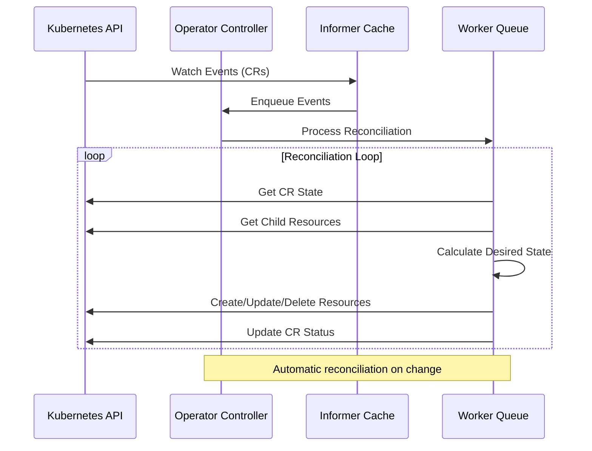

## The Problem

Our platform team was spending hours on repetitive operational tasks:

- Manual certificate rotation for TLS endpoints
- Manual scaling decisions based on metrics
- Inconsistent deployment configurations across environments
- No automated rollback capabilities

We needed a way to codify operational knowledge and let Kubernetes manage our custom workloads.

## Architecture Diagram

The operator implements the control pattern with reconciliation loops:



## Key Challenges

### Concurrency in Reconciliation

Handling multiple concurrent reconciliation requests for the same resource:

```go
func (r *MyResourceReconciler) Reconcile(ctx context.Context, req ctrl.Request) (ctrl.Result, error) {
  // Use a unique key per resource to prevent concurrent reconciliations
  key := req.NamespacedName.String()

  // Check if already reconciling
  if !r.semaphore.TryAcquire(key) {
    return ctrl.Result{RequeueAfter: time.Second * 5}, nil
  }
  defer r.semaphore.Release(key)

  // Fetch the resource
  resource := &mygroupv1.MyResource{}
  if err := r.Get(ctx, req.NamespacedName, resource); err != nil {
    return ctrl.Result{}, client.IgnoreNotFound(err)
  }

  // Reconcile logic here
  return r.reconcile(ctx, resource)
}
```

### Scaling with Work Queues

Implementing rate limiting and exponential backoff for failed reconciliations:

- **Rate Limiting**: Max 10 reconciliations per second per resource
- **Exponential Backoff**: 1s → 2s → 4s → 8s → max 1 minute
- **Fast Requeue**: For transient errors (network timeouts)
- **Slow Requeue**: For persistent errors requiring manual intervention

## Performance Metrics

The operator successfully manages production workloads:

| Metric | Value |
|--------|-------|
| Reconciliation Time | p50: 200ms, p99: 2s |
| Memory per Replica | 50MB RSS |
| CPU per Replica | 0.1 cores (idle), 0.5 cores (peak) |
| Uptime | 99.95% (planned maintenance excluded) |

## Operational Benefits

**Time Saved**: Automated 15+ operational tasks, saving ~20 hours/week

**Consistency**: All deployments follow the same codified patterns

**Self-Healing**: Automatic recovery from common failures without human intervention

**GitOps Ready**: Full integration with ArgoCD for declarative cluster management

The operator framework now serves as the foundation for all our custom Kubernetes controllers, reducing development time for new operators by 60%.
