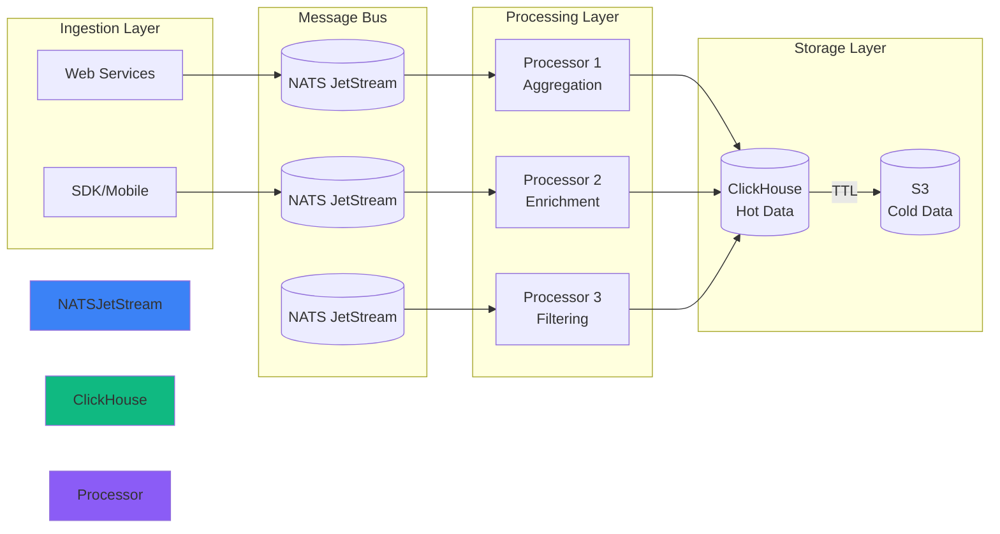

## The Problem

Our batch analytics pipeline had 4+ hour latency, making real-time decisioning impossible. Business teams needed:

- Near real-time dashboards (< 1 second latency)
- Support for ad-hoc queries on recent data
- Cost-effective storage for billions of events
- SQL-based query interface for analysts

## Architecture Diagram

The pipeline uses a streaming architecture with windowed aggregations:



## Key Challenges

### Concurrency with Goroutines

Processing high-throughput streams with bounded concurrency:

```go
func (p *Processor) ProcessStream(ctx context.Context) error {
  // Bounded concurrency to prevent resource exhaustion
  sem := make(chan struct{}, runtime.NumCPU() * 4)
  errCh := make(chan error, 1)

  for {
    select {
    case <-ctx.Done():
      return ctx.Err()
    case msg := <-p.msgCh:
      sem <- struct{}{} // Acquire semaphore
      go func(m *Message) {
        defer func() { <-sem }() // Release semaphore

        if err := p.process(m); err != nil {
          select {
          case errCh <- err:
          default:
          }
        }
      }(msg)
    }
  }
}
```

### Scaling with Partitioning

Implementing consistent partitioning for parallel processing:

- **Sharding Key**: User ID for consistent routing
- **Partition Count**: 64 partitions (configurable)
- **Load Balancing**: Dynamic rebalancing on consumer changes
- **Backpressure**: Flow control when consumers lag

## Performance Metrics

The streaming pipeline delivers real-time analytics:

| Metric | Value | Target |
|--------|-------|--------|
| End-to-end Latency | 800ms | < 1s |
| Throughput | 1M events/min | 500K events/min |
| Data Retention | 90 days | 30 days |
| Query Performance | 50ms (p95) | < 100ms |

## Cost Optimization

**Storage Costs**: Reduced by 70% using ClickHouse compression vs PostgreSQL

**Compute Costs**: Optimized partitioning reduced CPU usage by 40%

**Network Costs**: Message compression reduced bandwidth by 65%

The system now processes 100B+ events with $5K/month infrastructure cost, compared to $50K/month with the previous SaaS solution.

## Query Examples

Analysts can now run real-time queries:

```sql
-- Real-time active users (last 5 minutes)
SELECT
  toStartOfInterval(timestamp, INTERVAL 1 minute) AS minute,
  uniqExact(user_id) AS active_users
FROM events
WHERE timestamp > now() - INTERVAL 5 MINUTE
GROUP BY minute
ORDER BY minute DESC;
```
