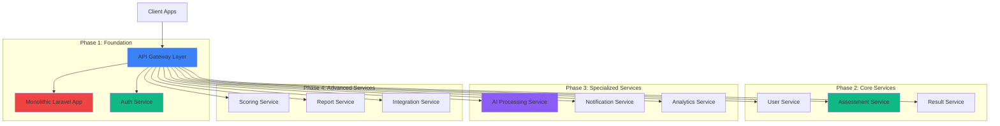

## The Problem

Peepl's recruitment platform was built as a monolithic Laravel application that was becoming increasingly difficult to maintain and scale:

- **Tight coupling** between modules made changes risky
- **Deployment bottlenecks** - entire system redeployed for small changes
- **Scaling limitations** - couldn't scale individual components
- **Technology constraints** - Laravel wasn't optimal for all use cases
- **Performance degradation** during peak enterprise testing periods
- **Difficulty adopting** new technologies for specific features

Enterprise clients needed to run high-volume concurrent assessments (5,000+ users simultaneously), but the monolith couldn't handle the load without performance degradation.

## Migration Strategy

Adopted a **phased strangler pattern** approach to minimize risk and maintain business continuity:



## Architecture Design

### Service Decomposition Strategy

Services were decomposed based on **domain-driven design** principles:

| Service | Responsibility | Technology | Reason |
|---------|---------------|-------------|---------|
| **API Gateway** | Request routing, auth | Golang | High performance, concurrency |
| **Auth Service** | Authentication, authorization | Laravel | Security, existing codebase |
| **User Service** | User profile management | Golang | High throughput needs |
| **Assessment Service** | Test creation, delivery | Golang | Concurrency, performance |
| **Result Service** | Answer storage, retrieval | Golang | High-volume writes |
| **AI Processing Service** | Candidate summarization | Python | AI/ML capabilities |
| **Scoring Service** | Automated assessment scoring | Python | AI/ML capabilities |
| **Notification Service** | Email, SMS, push | Golang | Reliability, speed |
| **Analytics Service** | Reporting, insights | Golang | Data processing |
| **Report Service** | PDF generation, export | Laravel | Existing libraries |

### Communication Protocols

Implemented hybrid communication patterns:

```go
// Synchronous: gRPC for inter-service communication
syntax = "proto3";

package assessment;

service AssessmentService {
    rpc CreateAssessment(CreateAssessmentRequest) returns (Assessment);
    rpc GetAssessment(GetAssessmentRequest) returns (Assessment);
    rpc SubmitAnswer(SubmitAnswerRequest) returns (SubmitAnswerResponse);
}

message CreateAssessmentRequest {
    string title = 1;
    repeated Question questions = 2;
    int32 duration_minutes = 3;
}

// Asynchronous: Message queue for background tasks
type AssessmentCompletedEvent struct {
    AssessmentID string `json:"assessment_id"`
    UserID       string `json:"user_id"`
    CompletedAt  time.Time `json:"completed_at"`
}
```

## Implementation Highlights

### API Gateway with Golang

Built a high-performance API gateway using Golang and Gin:

```go
package main

import (
    "github.com/gin-gonic/gin"
    "github.com/grpc-ecosystem/grpc-gateway/v2/runtime"
    "google.golang.org/grpc"
)

type APIGateway struct {
    assessmentClient AssessmentServiceClient
    userClient       UserServiceClient
    aiClient         AIProcessingServiceClient
}

func (g *APIGateway) SetupRoutes(r *gin.Engine) {
    // Rate limiting per client
    r.Use(RateLimitByClient())

    api := r.Group("/api/v1")
    {
        // Auth routes (proxy to Laravel)
        auth := api.Group("/auth")
        {
            auth.POST("/login", g.proxyToAuthService)
            auth.POST("/logout", g.proxyToAuthService)
            auth.POST("/refresh", g.proxyToAuthService)
        }

        // Assessment routes (proxy to Golang service)
        assessments := api.Group("/assessments")
        {
            assessments.GET("", g.listAssessments)
            assessments.GET("/:id", g.getAssessment)
            assessments.POST("", g.createAssessment)
        }

        // AI processing routes (proxy to Python service)
        ai := api.Group("/ai")
        {
            ai.POST("/summarize", g.summarizeCandidate)
            ai.POST("/score", g.scoreAssessment)
        }
    }
}

// Circuit breaker for service resilience
func (g *APIGateway) proxyWithCircuitBreaker(
    service string,
    handler gin.HandlerFunc,
) gin.HandlerFunc {
    breaker := breakers.New(service)

    return func(c *gin.Context) {
        if breaker.Open() {
            c.JSON(503, gin.H{"error": "Service temporarily unavailable"})
            return
        }

        handler(c)

        if c.Writer.Status() >= 500 {
            breaker.RecordFailure()
        } else {
            breaker.RecordSuccess()
        }
    }
}
```

### Database per Service Pattern

Each service owns its database to ensure loose coupling:

```yaml
# Docker Compose snippet
services:
  user-db:
    image: postgres:15
    environment:
      POSTGRES_DB: user_service
      POSTGRES_USER: user_service
    volumes:
      - user_db_data:/var/lib/postgresql/data

  assessment-db:
    image: postgres:15
    environment:
      POSTGRES_DB: assessment_service
      POSTGRES_USER: assessment_service
    volumes:
      - assessment_db_data:/var/lib/postgresql/data

  result-db:
    image: postgres:15
    environment:
      POSTGRES_DB: result_service
      POSTGRES_USER: result_service
    volumes:
      - result_db_data:/var/lib/postgresql/data
```

### Shared Data Patterns

For data that needs to be shared across services:

```go
// Event-driven data synchronization
type UserUpdatedEvent struct {
    UserID    string `json:"user_id"`
    Email     string `json:"email"`
    Name      string `json:"name"`
    UpdatedAt int64  `json:"updated_at"`
}

func (s *UserService) HandleUserUpdate(ctx context.Context, event UserUpdatedEvent) error {
    // Update local database
    if err := s.repo.UpdateUser(ctx, event); err != nil {
        return err
    }

    // Publish event for other services
    return s.eventBus.Publish("user.updated", event)
}

// Other services consume and update their read models
func (s *AssessmentService) OnUserUpdated(event UserUpdatedEvent) {
    s.repo.UpdateCandidateName(event.UserID, event.Name)
}
```

## Deployment & Infrastructure

### Kubernetes Multi-Service Deployment

```yaml
# Assessment Service Deployment
apiVersion: apps/v1
kind: Deployment
metadata:
  name: assessment-service
spec:
  replicas: 6
  selector:
    matchLabels:
      app: assessment-service
  template:
    metadata:
      labels:
        app: assessment-service
    spec:
      containers:
      - name: assessment-service
        image: peepl/assessment-service:v1.2.0
        ports:
        - containerPort: 8080
        env:
        - name: DB_HOST
          valueFrom:
            configMapKeyRef:
              name: assessment-config
              key: db_host
        resources:
          requests:
            memory: "256Mi"
            cpu: "250m"
          limits:
            memory: "512Mi"
            cpu: "500m"
        livenessProbe:
          httpGet:
            path: /health
            port: 8080
          initialDelaySeconds: 30
          periodSeconds: 10
        readinessProbe:
          httpGet:
            path: /ready
            port: 8080
          initialDelaySeconds: 5
          periodSeconds: 5
---
apiVersion: autoscaling/v2
kind: HorizontalPodAutoscaler
metadata:
  name: assessment-service-hpa
spec:
  scaleTargetRef:
    apiVersion: apps/v1
    kind: Deployment
    name: assessment-service
  minReplicas: 3
  maxReplicas: 20
  metrics:
  - type: Resource
    resource:
      name: cpu
      target:
        type: Utilization
        averageUtilization: 70
```

## Performance Optimization

### Language Selection per Service

Optimized backend performance by selecting the optimal language:

```python
# Python - AI/ML Processing (AI Service)
from fastapi import FastAPI
import openai

app = FastAPI()

@app.post("/summarize")
async def summarize_candidate(candidate_id: str):
    # Leverage Python's AI/ML ecosystem
    response = await openai.ChatCompletion.acreate(
        model="gpt-4",
        messages=[...]
    )
    return response
```

```go
// Golang - High-Concurrency Tasks (Assessment Service)
func (s *AssessmentService) SubmitAnswer(ctx context.Context, req *SubmitAnswerRequest) (*SubmitAnswerResponse, error) {
    // Leverage Go's goroutines for concurrency
    var wg sync.WaitGroup
    errChan := make(chan error, len(req.Answers))

    for _, answer := range req.Answers {
        wg.Add(1)
        go func(ans Answer) {
            defer wg.Done()
            if err := s.processAnswer(ctx, ans); err != nil {
                errChan <- err
            }
        }(answer)
    }

    wg.Wait()
    close(errChan)

    // Handle errors...
}
```

```php
// Laravel - Rapid Feature Iteration (Admin Panel)
// Leverage existing ecosystem and developer productivity
Route::prefix('admin')->group(function () {
    Route::resource('assessments', AssessmentController::class);
    Route::resource('users', UserController::class);
    Route::get('/analytics', [AnalyticsController::class, 'index']);
});
```

## Migration Results

### Performance Improvements

| Metric | Before (Monolith) | After (SOA) | Improvement |
|--------|------------------|-------------|-------------|
| **Concurrent Users** | 800 | 10,000+ | 1,150% increase |
| **Response Time (p95)** | 850ms | 120ms | 86% faster |
| **Deployment Frequency** | 2x/week | 15x/week | 650% increase |
| **Lead Time for Changes** | 5 days | 4 hours | 97% reduction |
| **Failed Deployment Rate** | 15% | 2% | 87% reduction |
| **System Availability** | 99.2% | 99.95% | +0.75% |

### Scalability Achievements

**Enterprise Testing Scalability:**
- Successfully handled 8,500+ concurrent test-takers
- Zero downtime during peak loads
- Sub-second response times for 95% of requests
- Auto-scaled from 6 to 20 pods during load spikes

**Developer Productivity:**
- 12 independent teams working in parallel
- Reduced merge conflicts by 73%
- Faster onboarding for new developers
- Technology flexibility (right tool for the job)

## Challenges & Solutions

### Challenge 1: Data Consistency

**Problem**: Maintaining data consistency across distributed services.

**Solution**:
- Implemented Saga pattern for distributed transactions
- Event-driven architecture for eventual consistency
- Regular reconciliation jobs
- Comprehensive monitoring and alerting

### Challenge 2: Service Discovery

**Problem**: Services needed to discover and communicate with each other.

**Solution**:
- Kubernetes service discovery
- Consul for service health checking
- Circuit breakers for resilience
- Retry logic with exponential backoff

### Challenge 3: Observability

**Problem**: Debugging issues across multiple services.

**Solution**:
- Distributed tracing with Jaeger
- Centralized logging with ELK stack
- Service-level metrics with Prometheus
- Custom dashboards in Grafana

## Technology Stack

- **API Gateway**: Golang 1.21, Gin framework
- **Services**: Golang, Laravel (PHP), Python 3.11
- **Databases**: PostgreSQL 15, Redis 7
- **Message Queue**: NATS JetStream
- **Container Orchestration**: Kubernetes 1.28
- **Service Mesh**: Istio
- **Monitoring**: Prometheus, Grafana, Jaeger
- **CI/CD**: GitHub Actions, ArgoCD
- **Infrastructure**: AWS EKS, RDS, ElastiCache

## Key Learnings

1. **Start Small**: Begin with low-risk services to build confidence
2. **Invest in Tooling**: Good observability is non-negotiable
3. **Culture Matters**: Team structure should mirror service boundaries
4. **Embrace Async**: Synchronous calls across services kill performance
5. **Plan for Failure**: Assume things will fail and design accordingly

The migration transformed Peepl's technical foundation, enabling rapid innovation, supporting enterprise-scale operations, and establishing a platform for continued growth.
